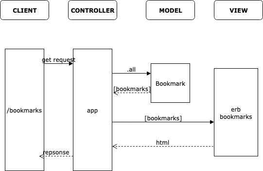

# Bookmarks Challenge

## Instructions
1. Connect to psql
2. Create the database using the psql command CREATE DATABASE bookmark_manager;
3. Connect to the database using the pqsl command \c bookmark_manager;
4. Run the query we have saved in the file 01_create_bookmarks_table.sql


We were tasked with creating a bookmarking tool with the following features:

- Show a list of bookmarks
- Add new bookmarks
- Delete bookmarks
- Update bookmarks
- Comment on bookmarks
- Tag bookmarks into categories
- Filter bookmarks by tag
- Users manage their bookmarks

We broke this down into the user stories below:

1. Show a list of bookmarks
```
As a user.
So that I can see bookmarks.
Show me a list of bookmarks when I click browse.
```

With this domain model:




Then we create domain models for these stories [here](https://www.draw.io/#G15yQIhLtMiCLSRnRoNFhIoWoJofYfC7DW).
